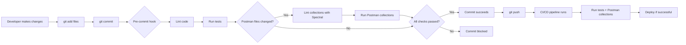

# Postman Native Git Cookbook

A comprehensive guide to integrating Postman collections, environments, and API specifications into your existing development workflows using [Postman's Native Git capabilities](https://learning.postman.com/docs/agent-mode/native-git#native-git-benefits).

## Overview

With Postman's Native Git feature, your API collections, specifications, environments, and other artifacts become **first-class citizens in your git repository**. This means all the quality checks, processes, and workflows you run against your code can now also be applied to your Postman artifacts.

This cookbook provides ready-to-use examples and templates for integrating Postman into common development workflows.

## What You'll Learn

This cookbook demonstrates how to:

- ✅ **Run Postman collections in pre-commit/pre-push hooks** alongside your existing linters and tests
- ✅ **Execute API tests in CI/CD pipelines** (GitHub Actions, GitLab CI, CircleCI)
- ✅ **Enforce best practices** in your collections using Spectral
- ✅ **Detect exposed secrets and credentials** before they reach your repository
- ✅ **Automate collection validation and testing** as part of your SDLC

## Quick Start

### Prerequisites

- **Node.js** (v16 or later)
- **Git** (v2.x or later)
- **Postman Account** ([Sign up for free](https://www.postman.com/))
- **Postman CLI** (installed via npm or standalone)

### 5-Minute Setup

```bash
# 1. Clone this cookbook repository
git clone https://github.com/Postman-Devrel/Postman-Native-Git-Cookbook.git
cd Postman-Native-Git-Cookbook

# 2. Install dependencies
npm install

# 3. Install and configure Postman CLI
npm install -g postman-cli
postman login

# 4. Explore the templates
ls -la .husky/          # Git hook templates
ls -la .github/workflows/  # CI/CD workflow templates
cat .spectral.yaml      # Spectral linting rules

# 5. Copy templates to your project
# Copy the files you need to your own project repository
```

**What's included:**
- ✅ Git hook templates for pre-commit validation
- ✅ Spectral rules for collection linting and secret detection
- ✅ GitHub Actions workflow templates
- ✅ Example Postman collections demonstrating best practices
- ✅ Comprehensive documentation guides

## Workflows & Recipes

### 1. Pre-Commit and Pre-Push Hooks

Run your Postman collections automatically before committing or pushing code.

**📖 Guide:** [Git Commit Hooks](./docs/COMMIT_HOOKS.md)

**Quick Example:**

```bash
# Edit .husky/pre-commit
#!/usr/bin/env sh
. "$(dirname -- "$0")/_/husky.sh"

echo "🔍 Linting code..."
npx lint-staged

echo "🧪 Running tests..."
npm test

# Run Postman collections only if they changed
if git diff --cached --name-only | grep -qE "postman/"; then
  echo "📬 Running Postman collections..."
  postman collection run
fi
```

**What this does:**
- Runs linter on staged files only (fast!)
- Executes your test suite
- Conditionally runs Postman collections when Postman files change
- Blocks commits if any check fails

**See also:**
- [10 Pre-Commit Hook Examples](./.husky/pre-commit-examples.sh)
- [Quick Reference Guide](./docs/QUICK_REFERENCE.md)

---

### 2. CI/CD Pipeline Integration

Integrate Postman collection testing into your continuous integration workflows.

**📖 Guide:** [CI/CD Integration](./docs/CI_CD.md)

**GitHub Actions Example:**

```yaml
name: API Tests

on: [push, pull_request]

jobs:
  test:
    runs-on: ubuntu-latest
    steps:
      - uses: actions/checkout@v4

      - name: Setup Node.js
        uses: actions/setup-node@v4
        with:
          node-version: '20'

      - name: Install Postman CLI
        run: curl -o- "https://dl-cli.pstmn.io/install/unix.sh" | sh

      - name: Install dependencies
        run: npm ci

      - name: Start server
        run: npm start &

      - name: Run Postman collections
        env:
          POSTMAN_API_KEY: ${{ secrets.POSTMAN_API_KEY }}
        run: |
          postman login --with-api-key "$POSTMAN_API_KEY"
          npm run test:api
```

**What this does:**
- Runs on every push and pull request
- Starts your API server
- Executes all Postman collections
- Reports test results in the GitHub Actions UI

**Available Examples:**
- [GitHub Actions Workflow](./.github/workflows/postman.yaml)
- GitLab CI, CircleCI templates in [CI/CD Guide](./docs/CI_CD.md)

---

### 3. Enforce Best Practices with Spectral

Use Spectral to lint your Postman collections and enforce organizational standards.

**📖 Guide:** [Spectral Linting Guide](./docs/SPECTRAL.md)

**Quick Example:**

```bash
# Lint all collections
npm run lint:collections

# Lint OpenAPI specs
npm run lint:specs
```

The cookbook ships two separate Spectral configs:

| Config | Targets | Command |
|---|---|---|
| `.spectral.yaml` | `postman/collections/` only | `npm run lint:collections` |
| `.spectral-openapi.yaml` | `postman/specs/` only | `npm run lint:specs` |

**What this does:**
- Validates collection structure, test coverage, and descriptions
- Enforces OpenAPI standards (operation IDs, tags, summaries, response codes)
- Detects hardcoded credentials before they reach git

**See also:**
- [Collection Spectral Configuration](./.spectral.yaml)
- [OpenAPI Spectral Configuration](./.spectral-openapi.yaml)
- [Custom Linting Script](./.spectral/lint-with-names.js)

---

### 4. Catch Exposed Secrets

Prevent hardcoded credentials from being committed to your repository.

**📖 Guide:** [Secret Detection](./docs/SPECTRAL.md#secret-detection)

**Built-in Rules:**

The `.spectral.yaml` configuration includes security rules that catch:

- Hardcoded Authorization headers
- Hardcoded API keys
- Hardcoded Bearer tokens
- Hardcoded Basic auth credentials
- Plain-text passwords

**Example Detection:**

```bash
$ npm run lint:collections

postman/collections/example.postman_collection.json
  45:12     error    no-hardcoded-apikey-header    🔒 SECURITY: Authentication contains hardcoded API key. Use {{variable}} syntax instead.
  67:15     error    no-hardcoded-bearer-token     Request "Login User" has a hardcoded Bearer token. Use {{variable}} syntax instead.

✖ 2 problems (2 errors, 0 warnings, 0 infos, 0 hints)
```

**What this does:**
- Scans all collection files for exposed credentials
- Blocks commits containing hardcoded secrets (when used in pre-commit hook)
- Provides clear error messages explaining what to fix
- Enforces the use of environment variables for sensitive data

**Best Practices:**
- Always use `{{variable}}` syntax for sensitive values
- Store credentials in environment files (excluded from git via `.gitignore`)
- Use Postman Vault for team credential management

---

## Repository Structure

```
.
├── .github/
│   └── workflows/
│       ├── postman.yaml              # Main CI workflow template
│       ├── multi-env.yaml            # Multi-environment matrix runner
│       ├── run-collections.yaml      # Collection runner template
│       ├── scheduled-health-check.yaml
│       ├── secret-scan.yaml
│       └── spectral-lint.yaml
├── .husky/
│   ├── pre-commit                    # Active pre-commit hook
│   ├── pre-commit-examples.sh        # 10 hook pattern examples
│   └── README.md                     # Hooks documentation
├── .spectral/
│   └── lint-with-names.js            # Enhanced Spectral linting script
├── .spectral.yaml                    # Spectral rules for collections
├── .spectral-openapi.yaml            # Spectral rules for OpenAPI specs
├── docs/
│   ├── CI_CD.md                      # CI/CD integration guide
│   ├── COMMIT_HOOKS.md               # Git hooks setup guide
│   ├── QUICK_REFERENCE.md            # Quick command reference
│   ├── SETUP.md                      # Initial setup instructions
│   ├── SPECTRAL.md                   # Spectral linting guide
│   ├── TESTING.md                    # Testing guide
│   └── WORKSPACE_PUSH.md             # postman workspace push reference
├── postman/
│   ├── collections/                  # Your Postman collections
│   ├── environments/                 # Environment files
│   └── specs/                        # OpenAPI/AsyncAPI specs
├── package.json                      # Project dependencies & scripts
└── README.md                         # This file
```

## Available NPM Scripts

```bash
# Linting
npm run lint:collections  # Lint Postman collections with Spectral
npm run lint:specs        # Lint OpenAPI specs in postman/specs/ with Spectral

# Git Hooks
npm run prepare           # Install husky hooks (runs automatically on npm install)
```

## How It Works

### The Workflow



### Key Benefits

1. **Early Detection**: Catch issues before they reach your repository
2. **Consistent Quality**: Automated checks ensure standards are met
3. **Faster Feedback**: Developers get immediate feedback locally
4. **Reduced CI Time**: Only run full tests in CI when needed
5. **Security**: Prevent credential exposure before commits
6. **Team Alignment**: Shared standards across all team members

## Common Use Cases

### Use Case 1: API-First Development Team

**Scenario:** Your team designs APIs in Postman, then implements them.

**Workflow:**
1. Design API in Postman, sync to git
2. Pre-commit hook validates collection structure with Spectral
3. CI pipeline runs collections as contract tests
4. Blocks PRs if API implementation doesn't match collection

**Tools Used:** Spectral validation, CI/CD integration

---

### Use Case 2: Microservices Team

**Scenario:** Multiple teams working on interconnected services.

**Workflow:**
1. Each service has its own Postman collection
2. Pre-commit hooks run relevant collections
3. CI runs integration tests across all services
4. Shared Spectral rules enforce consistency

**Tools Used:** Pre-commit hooks, CI/CD, Spectral

---

### Use Case 3: Security-Conscious Organization

**Scenario:** Need to prevent credential leaks and enforce security standards.

**Workflow:**
1. Spectral rules block hardcoded credentials
2. Pre-commit hooks scan for secrets
3. CI validates all collections for security issues
4. Automated reporting of security violations

**Tools Used:** Spectral secret detection, pre-commit hooks

---

## Customization Guide

### Customizing Pre-Commit Hooks

Edit `.husky/pre-commit` to modify what runs:

```bash
# Example: Skip Postman tests for documentation-only changes
if git diff --cached --name-only | grep -qE "src/|postman/"; then
  echo "📬 Running Postman tests..."
  postman collection run
else
  echo "⏭️  Documentation-only changes, skipping tests"
fi
```

### Customizing Spectral Rules

Edit `.spectral.yaml` to add custom rules:

```yaml
rules:
  custom-naming-convention:
    description: Request names should follow naming convention
    given: $..item[?(@.request)]
    severity: warn
    then:
      field: name
      function: pattern
      functionOptions:
        match: "^(GET|POST|PUT|DELETE|PATCH) .*$"
```

### Customizing CI/CD Workflows

Modify `.github/workflows/postman.yaml` or add new workflow files:

```yaml
# Example: Run collections on schedule
on:
  push:
  schedule:
    - cron: '0 */6 * * *'  # Every 6 hours
```

## Troubleshooting

### Common Issues

| Issue | Solution |
|-------|----------|
| Hooks not running | Run `npm run prepare` to reinstall hooks |
| Postman CLI not authenticated | Run `postman login` |
| Spectral linting fails | Check `.spectral.yaml` syntax with `spectral lint --help` |
| Collections fail in CI | Ensure server is running and `POSTMAN_API_KEY` is set |
| Slow pre-commit hook | Use conditional execution (only run on relevant file changes) |

### Getting Help

- **Postman Documentation**: https://learning.postman.com/
- **Postman CLI Docs**: https://learning.postman.com/docs/postman-cli/postman-cli-overview/
- **Spectral Documentation**: https://stoplight.io/open-source/spectral
- **Husky Documentation**: https://typicode.github.io/husky/

## Best Practices

### 1. Use Conditional Execution

Don't run Postman collections on every commit. Only run them when relevant files change:

```bash
if git diff --cached --name-only | grep -qE "postman/|src/routes/"; then
  postman collection run
fi
```

### 2. Keep Collections Fast

- Use pre-request scripts to skip slow tests during commits
- Reserve comprehensive tests for CI/CD
- Use environments to control test depth

### 3. Version Control Everything

- Include collections, environments, and globals in git
- Exclude `.env` files with actual secrets
- Use `.env.example` to document required variables

### 4. Layer Your Testing

```
Local Development → Pre-commit → Pre-push → CI/CD → Staging → Production
     (fast)          (quick)      (medium)   (comprehensive)
```

### 5. Fail Fast

Configure hooks to exit immediately on failure:

```bash
npm test || exit 1
postman collection run || exit 1
```

## What's in This Repository

This cookbook provides **ready-to-use templates** and **example configurations**:

### Templates & Configuration

- **Git Hooks** (`.husky/`): Pre-commit hook template with Spectral linting
- **GitHub Actions** (`.github/workflows/`): Workflow templates including multi-environment matrix runner
- **Spectral Rules** (`.spectral.yaml`): Collection linting with security checks
- **OpenAPI Spectral Rules** (`.spectral-openapi.yaml`): OpenAPI spec linting (targets `postman/specs/` only)
- **Example Collections** (`postman/`): Sample collections demonstrating best practices

### Documentation

- **README.md**: This file - cookbook overview
- **docs/SETUP.md**: Complete setup instructions
- **docs/CI_CD.md**: CI/CD integration guide (GitHub Actions, GitLab, CircleCI)
- **docs/SPECTRAL.md**: Spectral linting for collections and OpenAPI specs
- **docs/COMMIT_HOOKS.md**: Git hooks setup and patterns
- **docs/TESTING.md**: Testing patterns and strategies
- **docs/QUICK_REFERENCE.md**: Quick command reference
- **docs/WORKSPACE_PUSH.md**: `postman workspace push` reference — the handoff from git to Postman Cloud

### How to Use This Cookbook

1. **Clone the repository** to explore the templates
2. **Read the guides** for your specific workflow needs
3. **Copy the templates** you need to your own project
4. **Customize** for your API and requirements
5. **Test** the workflows with your collections

```bash
# Example: Copy git hooks to your project
cp -r Postman-Native-Git-Cookbook/.husky your-project/
cp Postman-Native-Git-Cookbook/.spectral.yaml your-project/

# Example: Copy a workflow template
cp Postman-Native-Git-Cookbook/.github/workflows/spectral-lint.yaml \
   your-project/.github/workflows/
```

## Contributing

Contributions welcome! If you have additional workflow examples or improvements:

1. Fork this repository
2. Create a feature branch
3. Add your example with documentation
4. Submit a pull request

## License

This project is licensed under the MIT License - see the [LICENSE](LICENSE) file for details.

## Additional Resources

- [Postman Native Git Documentation](https://learning.postman.com/docs/agent-mode/native-git)
- [Postman CLI Documentation](https://learning.postman.com/docs/postman-cli/postman-cli-overview/)
- [Spectral Documentation](https://stoplight.io/open-source/spectral)
- [Husky Documentation](https://typicode.github.io/husky/)
- [GitHub Actions Documentation](https://docs.github.com/en/actions)

---

**Ready to integrate Postman into your workflows?** Start with the [Setup Guide](./docs/SETUP.md) or dive into a specific workflow above!
