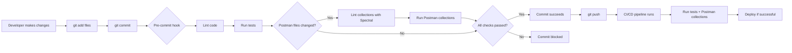

# Postman Native Git Cookbook

A comprehensive guide to integrating Postman collections, environments, and API specifications
into your existing development workflows using [Postman's Native Git capabilities](https://
learning.postman.com/docs/agent-mode/native-git#native-git-benefits).

## Quick start

**Prerequisites:**

- Node.js
- v22+
- Git,
- [Postman account](https://www.postman.com/)

```bash
git clone https://github.com/Postman-Devrel/Postman-Native-Git-Cookbook.git
cd Postman-Native-Git-Cookbook
npm install
postman login   # or use API key in CI
```

**Included:** Git hook templates (Husky + lint-staged), Spectral rules for collection linting (including secret detection), and GitHub Actions workflow templates.

## Workflows

| What                                                                         | Guide                                         | In this repo                                                                          |
| ---------------------------------------------------------------------------- | --------------------------------------------- | ------------------------------------------------------------------------------------- |
| **Pre-commit hooks** — lint and run collections when relevant files change   | [COMMIT_HOOKS.md](./docs/COMMIT_HOOKS.md)     | `.husky/pre-commit`, [.husky/pre-commit-examples.sh](./.husky/pre-commit-examples.sh) |
| **CI/CD** — run collections on push/PR, optional publish to Postman Cloud    | [CI_CD.md](./docs/CI_CD.md)                   | [.github/workflows/](./.github/workflows/)                                            |
| **Spectral** — lint collection JSON (structure, tests, no hardcoded secrets) | [SPECTRAL.md](./docs/SPECTRAL.md)             | `.spectral.yaml`, `.spectral/lint-with-names.js`                                      |
| **Publish to Cloud** — sync git → Postman Cloud on merge to main             | [WORKSPACE_PUSH.md](./docs/WORKSPACE_PUSH.md) | `postman workspace push -y` in workflow                                               |

## Repository structure

```
.github/workflows/     # GitHub Actions: lint-collections, run-collections, multi-env, scheduled-health-check, postman
.husky/                # Pre-commit hook + pre-commit-examples.sh
.spectral/             # lint-with-names.js (formatted Spectral output)
.spectral.yaml         # Spectral rules for postman/collections/
docs/                  # SETUP, CI_CD, COMMIT_HOOKS, SPECTRAL, TESTING, WORKSPACE_PUSH, QUICK_REFERENCE
postman/               # collections/, environments/
package.json           # lint:collections, prepare (husky)
```

## Commands

```bash
npm run lint:collections   # Lint Postman collections (Spectral)
npm run prepare            # Install Husky hooks (runs on npm install)
```

## Docs

| Doc                                             | Purpose                                             |
| ----------------------------------------------- | --------------------------------------------------- |
| [SETUP.md](./docs/SETUP.md)                     | Initial setup, Postman CLI, hooks, Spectral, CI     |
| [CI_CD.md](./docs/CI_CD.md)                     | GitHub Actions: run collections, secrets, workflows |
| [COMMIT_HOOKS.md](./docs/COMMIT_HOOKS.md)       | What runs on commit, adding Postman, examples       |
| [SPECTRAL.md](./docs/SPECTRAL.md)               | Lint collection JSON with `.spectral.yaml`          |
| [TESTING.md](./docs/TESTING.md)                 | Running collections, practices, troubleshooting     |
| [WORKSPACE_PUSH.md](./docs/WORKSPACE_PUSH.md)   | `postman workspace push` — git to Postman Cloud     |
| [QUICK_REFERENCE.md](./docs/QUICK_REFERENCE.md) | Command cheat sheet                                 |

## The Workflow



## Troubleshooting

| Issue                     | Fix                                                                                                  |
| ------------------------- | ---------------------------------------------------------------------------------------------------- |
| Hooks not running         | `npm run prepare`; ensure `.husky/pre-commit` is executable                                          |
| Postman not authenticated | `postman login` or `postman login --with-api-key KEY`                                                |
| Spectral fails            | Check `.spectral.yaml`; run `npx @stoplight/spectral-cli --version`                                  |
| CI fails                  | Set `POSTMAN_API_KEY` in repo secrets; wait for server/health before running collections             |
| Slow pre-commit           | Run Postman only when `postman/` or API code changed (see [COMMIT_HOOKS.md](./docs/COMMIT_HOOKS.md)) |

## Contributing

Contributions welcome: fork, branch, add examples or docs, open a PR.

## License

MIT — see [LICENSE](LICENSE).

---

**Next step:** [Setup Guide](./docs/SETUP.md) or pick a workflow from the table above.

**Links:** [Postman Native Git](https://learning.postman.com/docs/agent-mode/native-git) · [Postman CLI](https://learning.postman.com/docs/postman-cli/postman-cli-overview/) · [Spectral](https://stoplight.io/open-source/spectral) · [Husky](https://typicode.github.io/husky/)
